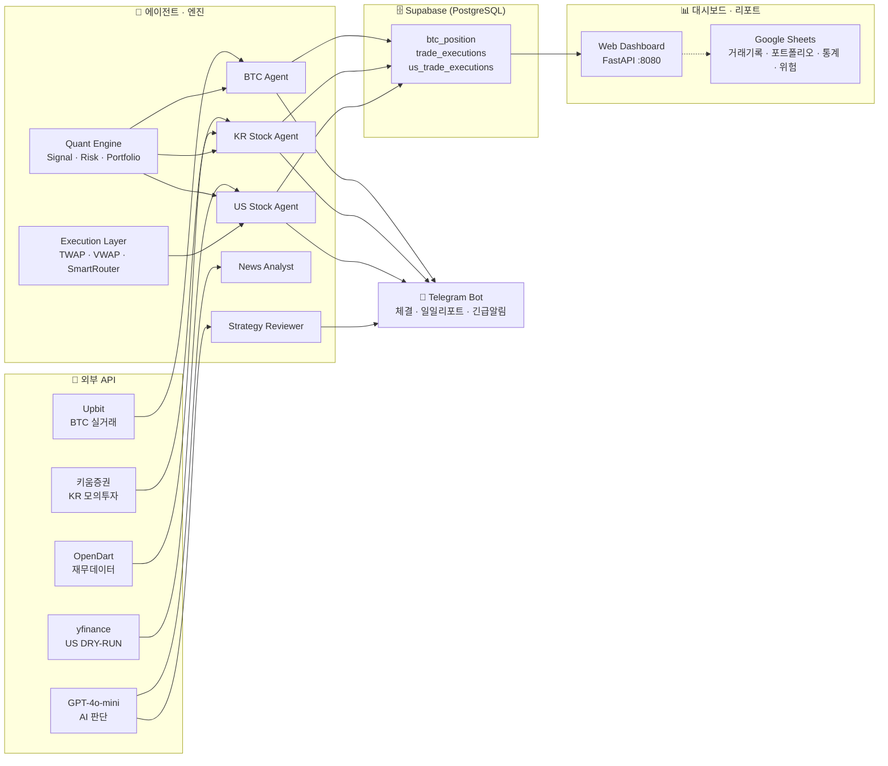

# OpenClaw Trading System v5.1

BTC · KR 주식 · US 주식 자동매매 통합 플랫폼 + Google Sheets 기록/대시보드

## 아키텍처



## 시스템 구성

| 항목 | 스택 |
|------|------|
| 서버 | GCP e2-small (24시간) |
| BTC 거래소 | Upbit API (실거래) |
| KR 주식 | 키움증권 REST API (모의투자) |
| US 주식 | yfinance + 모멘텀 스코어링 (DRY-RUN) |
| AI 판단 | GPT-4o-mini |
| DB | Supabase (PostgreSQL) |
| 알림 | Telegram Bot |
| Web 대시보드 | FastAPI + Lightweight Charts (포트 8080) |
| Google Sheets | gog CLI 또는 gspread (거래 기록·포트폴리오·통계) |
| ML | XGBoost (KR 주식 매수 예측) |

## 매매 전략

### BTC — 복합 스코어 스윙
- 복합 스코어 (F&G + 일봉 RSI + 볼린저밴드 + 거래량 + 추세 + 7일 수익률) 기반 진입
- 매수: 스코어 ≥ 45 또는 극단 공포(F&G ≤ 10) 오버라이드
- 손절 -3% / 익절 +15% / 트레일링 스탑 2% / 타임컷 7일 / 일일 최대 3회

### KR 주식 — AI + ML 하이브리드
- 모멘텀 + RSI/BB/거래량 + DART 재무 스코어, XGBoost 예측(78%+ 기준)
- 분할매수 3단계(최소 4시간 간격) / 손절 -3% / 익절 +8%
- 08:00 AI 브리핑 → 09:00~15:30 자동매매

### US 주식 — 모멘텀 랭킹
- S&P 500 + NASDAQ 100 유니버스, 5일/20일 수익률·거래량비·신고가 근접도 스코어
- A/B/C/D 등급, 상위 종목 진입 / 가상자본 $10k DRY-RUN

## 대시보드

### Web 대시보드 (포트 8080)
- **BTC** (`/`) — 캔들, 복합스코어, 포지션, F&G, 뉴스
- **KR 주식** (`/stocks`) — 포트폴리오, 보유종목, 스캐너, AI 전략, 로그
- **US 주식** (`/us`) — 시장 지수, 모멘텀 랭킹, 포지션, 환율(KRW)

갱신: 차트 5초 / 데이터 10~15초

### Google Sheets (선택)
- **거래기록**: 매수/매도/손절/익절 실시간 기록 (sheets_logger)
- **포트폴리오·통계·위험**: sheets_manager + dashboard_runner (10분 주기)
- **알림**: 손실·수익·포지션 임계값 시 텔레그램 (alert_system)

설정: [docs/GOOGLE_SHEETS_DASHBOARD.md](docs/GOOGLE_SHEETS_DASHBOARD.md), [docs/OPENCLAW_INTEGRATION.md](docs/OPENCLAW_INTEGRATION.md)

## 프로젝트 구조

```
workspace/
├── btc/
│   ├── btc_trading_agent.py        # BTC 매매 에이전트
│   ├── btc_dashboard.py            # Web 대시보드 엔트리 (FastAPI)
│   ├── routes/
│   │   ├── btc_api.py
│   │   ├── stock_api.py
│   │   └── us_api.py
│   ├── btc_news_collector.py
│   ├── btc_swing_backtest.py
│   ├── signals/                    # 온체인/오더플로우 등
│   ├── strategies/                 # 펀딩/캐리 등
│   └── templates/                  # HTML (btc, stocks, us)
├── stocks/
│   ├── stock_trading_agent.py      # KR 주식 에이전트
│   ├── us_stock_trading_agent.py   # US 주식 에이전트
│   ├── kiwoom_client.py
│   ├── ml_model.py
│   ├── stock_premarket.py
│   ├── us_stock_premarket.py
│   ├── stock_data_collector.py
│   ├── sync_manager.py
│   ├── telegram_bot.py
│   ├── backtester.py
│   ├── backtester_ml.py
│   ├── us_momentum_backtest.py
│   └── performance_report.py
├── agents/
│   ├── daily_loss_analyzer.py      # 일일 손실 분석 → 텔레그램
│   ├── daily_report.py
│   ├── weekly_report.py
│   ├── alert_manager.py
│   ├── news_analyst.py
│   ├── regime_classifier.py
│   └── strategy_reviewer.py
├── common/
│   ├── config.py
│   ├── env_loader.py
│   ├── supabase_client.py
│   ├── telegram.py
│   ├── logger.py
│   ├── retry.py
│   ├── indicators.py
│   ├── market_data.py
│   ├── sheets_logger.py            # 거래 시 시트 append (gog/gspread)
│   ├── sheets_manager.py           # 시트 포트폴리오/통계/위험 갱신
│   ├── alert_system.py             # 손실·수익·포지션 알림
│   ├── cache.py
│   └── utils.py
├── scripts/
│   ├── run_btc_cron.sh
│   ├── run_stock_cron.sh
│   ├── run_us_cron.sh
│   ├── run_top_tier_cron.sh        # 통합 크론 (BTC+KR+US 등)
│   ├── run_dashboard.sh
│   ├── run_dry_test.sh
│   ├── check_health.sh
│   ├── dashboard_runner.py         # Google Sheets 대시보드 주기 실행
│   ├── setup_dashboard_cron.sh     # 대시보드/분석/알림 크론 등록
│   ├── update_sheets_dashboard.sh
│   └── crontab.top_tier.sample     # 크론 예시
├── dashboard/                      # React 대시보드 (선택)
├── docs/
│   ├── GOOGLE_SHEETS_DASHBOARD.md
│   ├── OPENCLAW_INTEGRATION.md
│   ├── telegram_commands.md
│   └── top-tier-phases.md
├── schema/                         # Supabase 스키마
├── supabase/                       # US 스키마 등
├── brain/                          # AI 분석 결과 저장소 (일일요약·뉴스·시장·워치리스트)
├── secretary/                      # 비서 에이전트 (Notion 연동·메모리·자율학습)
│   └── core/                       #   agency_memory, approval, notion_skill 등
├── quant/                          # 퀀트 엔진
│   ├── signal_evaluator.py         #   신호 IC/IR 측정 + Supabase 저장
│   ├── backtest/                   #   백테스트 엔진 + 유니버스
│   ├── factors/                    #   팩터 레지스트리·분석·결합
│   ├── portfolio/                  #   최적화·리밸런싱·귀속분석
│   └── risk/                       #   VaR·낙폭가드·포지션사이징·상관관계
├── execution/                      # 주문 실행 레이어
│   ├── twap.py                     #   TWAP 알고리즘
│   ├── vwap.py                     #   VWAP 알고리즘
│   ├── smart_router.py             #   스마트 라우팅 (us_broker 연동)
│   └── slippage_tracker.py         #   슬리피지 추적
├── skills/                         # 참조 스킬 라이브러리 (15개)
│   │                               #   btc-indicators · kiwoom-api · upbit-api
│   │                               #   opendart-api · supabase-best-practices 등
└── archive/                        # 레거시 + 미사용 폴더 보관
```

## 실행

```bash
source .venv/bin/activate

# 에이전트
python btc/btc_trading_agent.py
python stocks/stock_trading_agent.py
python stocks/us_stock_trading_agent.py

# Web 대시보드
python btc/btc_dashboard.py

# 성과 리포트
python stocks/performance_report.py kr
python stocks/performance_report.py us

# Google Sheets 대시보드 (설정 시)
python scripts/dashboard_runner.py
python agents/daily_loss_analyzer.py
python common/alert_system.py
```

## Cron 예시

```
*/5 * * * *     scripts/run_btc_cron.sh
0 * * * *       scripts/run_btc_cron.sh report
*/10 9-15 * * 1-5  stocks/stock_trading_agent.py   # KR
0 8 * * 1-5     stocks/stock_premarket.py
30 22 * * *     stocks/us_stock_premarket.py
0 18 * * 1-5    stocks/stock_data_collector.py
0 3 * * 6       stocks/ml_model.py                # ML 재학습

# Google Sheets·분석·알림 (선택)
*/10 * * * *    python scripts/dashboard_runner.py
0 0 * * *       python agents/daily_loss_analyzer.py
0 9 * * *       python common/alert_system.py
```

전체 예시: `scripts/crontab.top_tier.sample` 참고. 자동 등록: `./scripts/setup_dashboard_cron.sh`

## 환경변수

`openclaw.json` 또는 `.env` (common/env_loader.py):

```
UPBIT_ACCESS_KEY=
UPBIT_SECRET_KEY=
SUPABASE_URL=
SUPABASE_SECRET_KEY=
OPENAI_API_KEY=
TELEGRAM_BOT_TOKEN=
TELEGRAM_CHAT_ID=
KIWOOM_APP_KEY=
KIWOOM_APP_SECRET=
OPENDART_API_KEY=
```

Google Sheets 사용 시:

```
GOOGLE_SHEET_ID=
GOOGLE_SHEET_TAB=거래기록
GOG_KEYRING_PASSWORD=     # gog CLI 사용 시
# 또는
GOOGLE_SHEETS_CREDENTIALS_JSON=  # gspread 사용 시
```

선택: `BRAVE_API_KEY` (일일 손실 분석 뉴스 검색)

**보안**: 시트 ID·비밀번호는 저장소에 올리지 말고 `.env` 또는 환경변수로 관리.

## 리스크 설정

| 시장 | 손절 | 익절 | 트레일링 | 최대 포지션 | 일일 한도 |
|------|------|------|----------|-------------|-----------|
| BTC | -3% | +15% | 2% | 1 | 3회 |
| KR 주식 | -3% | +8% | - | 5 | 2회/종목 |
| US 주식 | -5% | +12% | 3% | 5 | DRY-RUN |

## 문서

| 문서 | 설명 |
|------|------|
| [GOOGLE_SHEETS_DASHBOARD.md](docs/GOOGLE_SHEETS_DASHBOARD.md) | Google Sheets 대시보드 설정·사용 |
| [OPENCLAW_INTEGRATION.md](docs/OPENCLAW_INTEGRATION.md) | gog·시트·일일분석·OpenClaw 연동 |
| [telegram_commands.md](docs/telegram_commands.md) | 텔레그램 봇 명령어 |
| [top-tier-phases.md](docs/top-tier-phases.md) | Top-tier 단계별 스펙 |

## 설치 요약

1. **의존성**: `pip install -r requirements.txt`
2. **Web 대시보드**: `python btc/btc_dashboard.py` → http://서버:8080
3. **Google Sheets**: gog CLI 또는 gspread 설정 후 `GOOGLE_SHEET_ID` 설정. 상세는 docs 참고.
4. **크론**: `scripts/run_btc_cron.sh`, `run_stock_cron.sh`, `run_us_cron.sh` 또는 `run_top_tier_cron.sh` 및 필요 시 `setup_dashboard_cron.sh`
