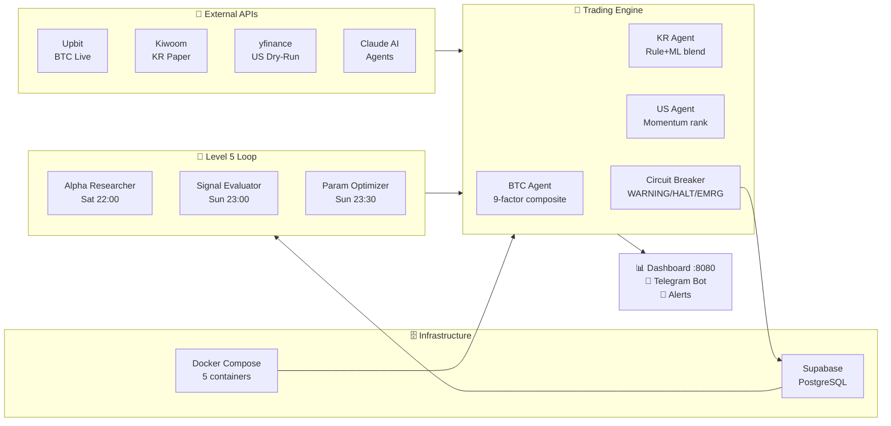

# OpenClaw Trading System

<p align="center"><strong>BTC · KR Stocks · US Stocks — Fully Automated Quantitative Trading Platform</strong></p>

<p align="center">
  <a href="https://www.python.org/downloads/"></a>
  <a href="LICENSE"></a>
  
  
  
  
  <a href="https://github.com/zln02/openclaw-trading/stargazers"></a>
</p>

<p align="center">
  <a href="README.ko.md">한국어 README</a> ·
  <a href="docs/SCREENSHOT_GUIDE.md">Screenshot Guide</a>
</p>

---

## Overview

OpenClaw is a production-oriented automated trading platform covering three markets simultaneously:

| Market | Mode | Broker | Signal Engine |
|--------|------|--------|---------------|
| **BTC** | Live | Upbit | 9-factor composite score + regime filter |
| **KR Stocks** | Paper | Kiwoom | Rule-based + XGBoost ML blend |
| **US Stocks** | Dry-run | yfinance | Multi-factor momentum ranking |

The system is self-improving: a weekly research loop evaluates signal IC/IR, auto-tunes parameters, and feeds improvements back into live agents.

---

## Quick Start

### Prerequisites

- Python 3.11+, Docker & Docker Compose
- Upbit API keys (BTC live trading)
- Telegram Bot Token (alerts & control)
- Optional: Kiwoom credentials (KR paper), Supabase project

```bash
git clone https://github.com/zln02/openclaw-trading
cd openclaw-trading
cp btc/.env.example .env              # Create a base env file
bash scripts/split_docker_env.sh .env # Generate .env.runtime + .docker-secrets/
docker compose up -d                  # Launch all services
```

The dashboard is available at `http://localhost:8080`. Docker Compose runs 5 services:
`dashboard`, `btc-agent`, `kr-agent`, `us-agent`, and `telegram-bot`.

---

## Features

<details>
<summary><strong>BTC — Composite Signal Engine</strong></summary>

The BTC agent runs a 9-factor composite scoring model (0–100 points) on every cycle:

| Component | Max Score | Signal Logic |
|-----------|----------:|-------------|
| Fear & Greed | 22 | Contrarian — extreme fear = opportunity |
| RSI (daily) | 20 | Oversold reversal detection |
| Bollinger Band | 12 | Lower band proximity |
| Volume (daily) | 10 | Conviction filter |
| HTF Trend | 12 | EMA-20/50 crossover direction |
| Funding Rate | 8 | Short crowding = buy signal |
| News Sentiment | ±8 | Claude/GPT news analysis |
| Long/Short Ratio | 6 | Contrarian positioning |
| OI / Whale | 5 | On-chain flow confirmation |

**Entry conditions:**
- Composite ≥ 50 (NORMAL regime), ≥ 60 (defensive), ≥ 65 (BEAR/CRISIS)
- F&G ≤ 15 extreme fear override (bypasses score threshold)
- Kimchi premium ≥ 5% → buy blocked
- Funding rate long-crowded → buy blocked
- Whale signal passed to composite (live)

**Risk controls:**
- Stop-loss: −3% (ATR-based dynamic)
- Partial TP: +2% → 50%, +3% → 50% remaining, +4% → full exit
- Trailing stop: adaptive 1.5–2.5%
- Daily loss limit: −8%
- Circuit breaker: WARNING at −15%, HALT at −25%, EMERGENCY at −35%
- Process-level buy lock (thread-safe, 1-hour cooldown)
- Max 2 trades/day

**Safety fixes applied (2026-03-16):**
- Upbit order return value validated before DB write
- All live sell paths now use shared order validation + exception handling
- `_buy_lock` thread lock properly acquired
- Circuit breaker imported at module level (always active)
- `funding_blocked` flag now enforces buy halt
- Whale signal wired into composite score
- UTC-aligned timestamps, daily loss checks, and daily buy counters

</details>

<details>
<summary><strong>KR Stocks — Rule + ML Blend</strong></summary>

- **Signal:** Rule-based RSI/BB/MACD score blended with XGBoost ML model (50/50 weight)
- **ML:** Multi-horizon XGBoost (3d/5d/10d) + LightGBM + CatBoost stacking ensemble
- **Walk-forward validation:** TimeSeriesSplit CV with SHAP analysis
- **Regime-aware:** Momentum/quality factor weights adjusted per market regime
- **Position limits:** Max positions, sector concentration cap, split-buy staging
- **Risk:** −2.5% stop-loss, +8% take-profit, partial TP at +5%, 60-min cooldown

**Fixes applied (2026-03-16):**
- STOP_TRADING flag path unified between Telegram bot and agent
- `entry_price` now persisted to DB for accurate daily loss tracking
- Kiwoom order retries disabled (prevents duplicate orders)
- ML `MODEL_DIR` import fixed (was causing silent ML failure every cycle)
- UTC-aligned cooldown and daily-loss time windows

</details>

<details>
<summary><strong>US Stocks — Momentum Ranking</strong></summary>

- **Universe:** ~56 US equities screened for momentum, value, and quality
- **Signal:** Multi-factor score (RSI, relative strength, BB, volume, PE/PB, ROE)
- **Market filter:** S&P 500 regime (BULL/CORRECTION/BEAR) gates all buy decisions
- **ML drift gate:** PSI-based feature drift detection blocks trades when model is stale
- **Execution:** Market-hour aware, max 3 buys/day, 2-hour cooldown

**Fixes applied (2026-03-16):**
- `factor_snapshot` DB update now uses row ID (prevents multi-row corruption)
- `save_trade()` returns inserted row ID
- UTC-aligned daily buy count

</details>

<details>
<summary><strong>Level 5 Research Loop</strong></summary>

Weekly automated parameter refinement:

```
[Saturday 22:00]  alpha_researcher.py   → brain/alpha/best_params.json
[Sunday  23:00]   signal_evaluator.py   → IC/IR per signal → weights.json
[Sunday  23:30]   param_optimizer.py    → auto-apply params + Telegram report
[Daily   08:30]   ml_model.py retrain   → live trade feedback loop
```

- **Alpha Researcher:** Grid-search over rule parameters, ranks by IC/IR
- **Signal Evaluator:** Pearson IC, permutation-test significance, rolling IR
- **Param Optimizer:** Applies improvements only when IR improvement ≥ threshold
- **Attribution:** Weekly factor PnL attribution with auto-downweighting of weak factors

</details>

<details>
<summary><strong>AI Agent Team</strong></summary>

The dashboard currently exposes 5 named agents:

| Agent | Model | Role |
|-------|-------|------|
| Orchestrator | Claude Opus | Decision coordination, adaptive thinking |
| Market Analyst | Claude Sonnet | Market regime + signal generation |
| News Analyst | Claude Sonnet | News sentiment, event detection |
| Risk Manager | Claude Opus | Drawdown, VaR, position risk |
| Reporter | Claude Sonnet | Daily/weekly reports, Telegram delivery |

The decision layer combines market data, fear & greed, kimchi premium, portfolio state, and risk metrics before issuing BUY/SELL/HOLD actions.

</details>

<details>
<summary><strong>Dashboard</strong></summary>

React + FastAPI dashboard at `http://localhost:8080`:

- **BTC tab:** Candlestick chart, composite score gauge, open position card, 9-signal bars, F&G indicator, news feed, decision log
- **KR tab:** Portfolio pie chart, holdings table, momentum ranking, market summary
- **US tab:** Index cards (SPY/QQQ/DXY/VIX), momentum ranking, FX rate, open positions
- **Agents tab:** 5-agent decision history with confidence scores

All tabs poll via REST API; auth-protected with rate-limited login.

</details>

<details>
<summary><strong>Security & Operations</strong></summary>

- API keys stored in `.env` files, never committed
- Docker secrets mounted at `/run/local-secrets/` (or `/run/secrets/`)
- Dashboard auth: `secrets.compare_digest`, 5-attempt rate limiting, lockout
- CORS: env-configurable origins, `credentials=False`, GET/OPTIONS only
- Circuit breaker: 3-level portfolio drawdown guard (WARNING / HALT / EMERGENCY)
- DrawdownGuard: weekly and monthly stop rules, auto-deleverage
- `pre-commit` hooks: detect-private-key, flake8, isort
- Cron + Docker dual-execution prevented: BTC/US run exclusively in Docker

</details>

---

## Architecture


```mermaid
flowchart LR

subgraph Ext["📡 External APIs"]
  Upbit["Upbit\nBTC Live"]
  Kiwoom["Kiwoom\nKR Paper"]
  YF["yfinance\nUS Dry-Run"]
  Claude["Claude AI\nAgents"]
end

subgraph Core["🤖 Trading Engine"]
  BTC["BTC Agent\n9-factor composite"]
  KR["KR Agent\nRule+ML blend"]
  US["US Agent\nMomentum rank"]
  CB["Circuit Breaker\nWARNING/HALT/EMRG"]
end

subgraph Research["🔬 Level 5 Loop"]
  Alpha["Alpha Researcher\nSat 22:00"]
  Eval["Signal Evaluator\nSun 23:00"]
  Opt["Param Optimizer\nSun 23:30"]
end

subgraph Infra["🗄️ Infrastructure"]
  DB["Supabase\nPostgreSQL"]
  Docker["Docker Compose\n5 containers"]
end

Output["📊 Dashboard :8080\n📱 Telegram Bot\n🔔 Alerts"]

Ext --> Core
Core --> CB --> DB
DB --> Research --> Core
Docker --> Core
Core --> Output
```

---

## Project Structure

```text
.
├── agents/              # AI agent team (orchestrator, analysts, reporter)
├── btc/                 # BTC agent, routes (btc/kr/us APIs), signals, strategies
├── common/              # Config, env loader, logger, Telegram, Supabase, circuit breaker
├── company/             # AI Software Company (CEO→specialist delegation)
├── dashboard/           # React frontend (BTC/KR/US/Agents pages)
├── docs/                # Documentation, audit reports, specs
├── execution/           # TWAP/VWAP execution, smart routing, slippage
├── quant/               # Alpha research, signal evaluator, param optimizer, risk, portfolio
├── scripts/             # Cron wrappers, health checks, agent loop runner
├── secretary/           # Autonomous helper, Notion integration, memory
├── stocks/              # KR/US agents, ML model, Kiwoom client, Telegram bot
├── tests/               # Pytest suite (metrics, utils, trade calculations)
├── docker-compose.yml   # 5-service runtime (dashboard, btc-agent, kr-agent, us-agent, telegram-bot)
├── Dockerfile
├── pytest.ini
├── README.md            # English README (this file)
└── README.ko.md         # Korean README
```

---

## Roadmap

- [x] Level 3: Adaptive Composite Signals
- [x] Level 4: Factor Model Operations (IC/IR → live weights)
- [x] Level 5: Research-to-Production Loop (alpha → signal eval → param opt)
- [x] Safety hardening: circuit breaker, buy lock, order validation, UTC alignment
- [ ] Level 6: Multi-Strategy Portfolio (Long-Short + Market Neutral)
- [ ] ML dead feature cleanup (13 inactive features → AUC improvement target)
- [ ] KR partial TP quantity tracking fix
- [ ] Dashboard: async-safe blocking calls, React Context shared state
- [ ] Level 7: On-chain DEX Arbitrage
- [ ] Multi-Exchange Support (Binance, Bybit)
- [ ] Portfolio Analytics (Sharpe, Sortino, MDD visualization)
- [ ] Mobile Dashboard (React Native)

---

## Contributing

Open an issue or PR if you want to contribute improvements.

## License

MIT License — see [LICENSE](LICENSE).
