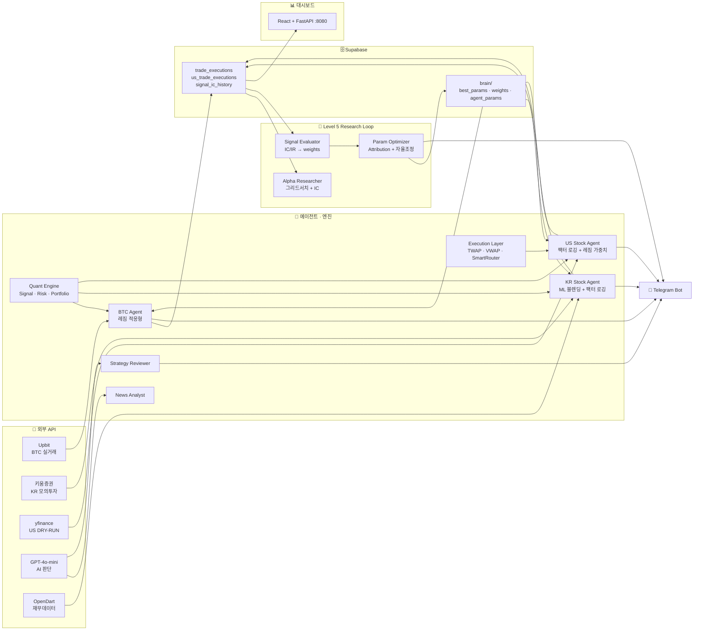

# OpenClaw Trading System v6.0

BTC · KR 주식 · US 주식 자동매매 통합 플랫폼
Level 5 — 연구-실전 루프 (알파 발굴 → 검증 → 자동 반영)

---

## 시스템 레벨

| Level | 내용 | 상태 |
|-------|------|------|
| 3 | 적응형 (복합신호 + 리스크관리) | ✅ |
| 4 | 팩터 모델 운용 (IC/IR → 가중치 → 포트폴리오) | ✅ |
| 5 | 연구-실전 루프 (알파 발굴 → 검증 → 자동 반영) | ✅ |

---

## Level 5 Research Loop

| 스크립트 | 실행 시점 | 역할 |
|----------|-----------|------|
| `quant/alpha_researcher.py` | 토요일 22:00 | 룰 기반 파라미터 그리드서치 + walk-forward IC/IR |
| `quant/signal_evaluator.py` | 일요일 23:00 | 신호 IC/IR 계산 → `brain/signal-ic/weights.json` 업데이트 |
| `quant/param_optimizer.py` | 일요일 23:30 | Attribution 분석 + 자율 파라미터 조정 + 텔레그램 알림 |
| `stocks/ml_model.py retrain` | 평일 08:30 | KR 50회 체결 시 XGBoost 자동 재학습 |

```
[매일 실매매]
  BTC/KR/US 에이전트
    → 진입 시: factor_snapshot 저장
    → ML 신호 블렌딩 (KR: rule×0.6 + ML×0.4)
    → 레짐 적응형 팩터 가중치 (RISK_ON/OFF/TRANSITION/CRISIS)

[매주]
  토 22:00  Alpha Researcher  → brain/alpha/best_params.json
  일 23:00  Signal Evaluator  → brain/signal-ic/weights.json
  일 23:30  Param Optimizer   → brain/agent_params.json + 텔레그램
```

---

## 아키텍처


```mermaid
flowchart LR
    subgraph Ext["📡 외부 API"]
        Upbit["Upbit\nBTC 실거래"]
        Kiwoom["키움증권\nKR 모의투자"]
        YF["yfinance\nUS DRY-RUN"]
        GPT["GPT-4o-mini\nAI 판단"]
        Dart["OpenDart\n재무데이터"]
    end

    subgraph Core["🤖 에이전트 · 엔진"]
        BTC["BTC Agent\n레짐 적응형"]
        KR["KR Stock Agent\nML 블렌딩 + 팩터 로깅"]
        US["US Stock Agent\n팩터 로깅 + 레짐 가중치"]
        News["News Analyst"]
        Rev["Strategy Reviewer"]
        Quant["Quant Engine\nSignal · Risk · Portfolio"]
        Exec["Execution Layer\nTWAP · VWAP · SmartRouter"]
    end

    subgraph Research["🔬 Level 5 Research Loop"]
        Alpha["Alpha Researcher\n그리드서치 + IC"]
        SigEval["Signal Evaluator\nIC/IR → weights"]
        ParamOpt["Param Optimizer\nAttribution + 자율조정"]
    end

    subgraph DB["🗄️ Supabase"]
        Pos["trade_executions\nus_trade_executions\nsignal_ic_history"]
        Brain["brain/\nbest_params · weights · agent_params"]
    end

    subgraph Dash["📊 대시보드"]
        Web["React + FastAPI :8080"]
    end

    TG["🔔 Telegram Bot"]

    Upbit --> BTC
    Kiwoom --> KR
    YF --> US
    GPT --> News & Rev
    Dart --> KR
    Quant --> BTC & KR & US
    Exec --> US
    BTC & KR & US --> Pos
    Pos --> Alpha & SigEval
    SigEval --> ParamOpt --> Brain
    Brain --> BTC & KR & US
    Pos --> Web
    BTC & KR & US & Rev & ParamOpt --> TG
```

---

## 시스템 구성

| 항목 | 스택 |
|------|------|
| 서버 | GCP e2-small (24시간) |
| BTC 거래소 | Upbit API (실거래) |
| KR 주식 | 키움증권 REST API (모의투자) |
| US 주식 | yfinance + 모멘텀 스코어링 (DRY-RUN) |
| AI 판단 | GPT-4o-mini |
| ML | XGBoost (KR 주식, walk-forward CV + SHAP) |
| DB | Supabase (PostgreSQL) |
| 알림 | Telegram Bot |
| Web 대시보드 | FastAPI + React/Vite (포트 8080) |
| Google Sheets | gspread (거래 기록·포트폴리오·통계) |

---

## 매매 전략

### BTC — 레짐 적응형 복합 스코어
- 복합 스코어 (F&G + RSI + 볼린저밴드 + 거래량 + 추세 + 7일 수익률) 기반 진입
- 레짐(RISK_ON/OFF/TRANSITION/CRISIS)별 팩터 가중치 동적 조절
- 매수: 스코어 ≥ 45 또는 극단 공포(F&G ≤ 10) 오버라이드
- 손절 -3% / 익절 +15% / 트레일링 스탑 2% / 타임컷 7일 / 일일 최대 3회

### KR 주식 — AI + ML 하이브리드 + 레짐 적응
- 모멘텀 + RSI/BB/거래량 + DART 재무 스코어 (룰 기반 60%)
- XGBoost ML 예측 블렌딩 (40%), ML 단독 78%+ 시 즉시 매수
- 레짐별 팩터 가중치 동적 조절 (RISK_OFF: 가치/퀄리티↑, 모멘텀↓)
- 진입 시 top-5 팩터 스코어 `factor_snapshot` 저장 → 귀속 분석
- 분할매수 3단계(최소 4시간 간격) / 손절 -3% / 익절 +8%
- 08:00 AI 브리핑 → 09:00~15:30 자동매매

### US 주식 — 모멘텀 랭킹 + 레짐 적응
- S&P 500 + NASDAQ 100 유니버스, 5일/20일 수익률·거래량비·신고가 근접도 스코어
- 레짐별 모멘텀/가치 가중치 조절, factor_snapshot 저장
- A/B/C/D 등급, 상위 종목 진입 / 가상자본 $10k DRY-RUN

---

## 대시보드 (포트 8080)

| 탭 | 경로 | 내용 |
|----|------|------|
| BTC | `/` | 캔들, 복합스코어, 포지션, F&G, 뉴스, 온체인 |
| KR 주식 | `/kr` | 포트폴리오(키움 실시간), 보유종목, TOP 모멘텀 종목, 거래기록 |
| US 주식 | `/us` | 시장 지수, 모멘텀 랭킹, 포지션, 환율(KRW) |
| 에이전트 | `/agents` | AI 에이전트 결정 이력 |

상단 배너: BTC·KR·US 총자산·손익 실시간 트리뷰

---

## 프로젝트 구조

```
workspace/
├── btc/
│   ├── btc_trading_agent.py        # BTC 매매 에이전트 (레짐 적응형)
│   ├── btc_dashboard.py            # Web 대시보드 엔트리 (FastAPI)
│   ├── routes/
│   │   ├── btc_api.py
│   │   ├── stock_api.py            # KR/US API 엔드포인트
│   │   └── us_api.py
│   └── signals/                    # 온체인/오더플로우/캐리/고래 시그널
├── stocks/
│   ├── stock_trading_agent.py      # KR 에이전트 (ML 블렌딩 + 팩터 로깅)
│   ├── us_stock_trading_agent.py   # US 에이전트 (팩터 로깅 + 레짐 가중치)
│   ├── ml_model.py                 # XGBoost (walk-forward CV + SHAP + retrain)
│   ├── kiwoom_client.py
│   ├── stock_data_collector.py
│   └── telegram_bot.py
├── quant/
│   ├── alpha_researcher.py         # Level 5: 파라미터 그리드서치 + walk-forward IC
│   ├── param_optimizer.py          # Level 5: 자율 파라미터 조정
│   ├── signal_evaluator.py         # IC/IR 측정 + Supabase 저장
│   ├── backtest/                   # 백테스트 엔진 + 유니버스
│   ├── factors/                    # 팩터 레지스트리·분석·결합 (20개 팩터)
│   ├── portfolio/
│   │   └── attribution.py          # Brinson 귀속분석 + WeeklyAttributionRunner
│   └── risk/                       # VaR·낙폭가드·포지션사이징·상관관계
├── agents/
│   ├── regime_classifier.py        # 레짐 분류 (RISK_ON/OFF/TRANSITION/CRISIS)
│   ├── news_analyst.py
│   ├── strategy_reviewer.py
│   ├── alert_manager.py
│   └── daily_report.py / weekly_report.py
├── common/
│   ├── config.py                   # 전역 파라미터 (ALPHA_PARAM_SPACE 포함)
│   ├── env_loader.py
│   ├── supabase_client.py
│   ├── telegram.py
│   └── logger.py
├── scripts/
│   ├── run_btc_cron.sh
│   ├── run_stock_cron.sh
│   ├── run_us_cron.sh
│   ├── run_top_tier_cron.sh
│   ├── run_alpha_researcher.sh     # Level 5 크론 래퍼
│   ├── run_signal_evaluator.sh     # Level 5 크론 래퍼
│   ├── run_param_optimizer.sh      # Level 5 크론 래퍼
│   ├── run_dashboard.sh
│   ├── check_health.sh
│   └── crontab.top_tier.sample     # 전체 크론 예시 (적용됨)
├── dashboard/                      # React + Vite 프론트엔드
│   └── src/pages/
│       ├── BtcPage.jsx
│       ├── KrStockPage.jsx         # 키움 실시간 포트폴리오
│       ├── UsStockPage.jsx
│       └── AgentsPage.jsx
├── supabase/
│   ├── us_schema.sql
│   ├── agent_decisions_schema.sql
│   └── level5_columns.sql          # Level 5 마이그레이션
├── brain/                          # 분석 결과 저장소
│   ├── signal-ic/weights.json      # 신호 IC 가중치
│   ├── alpha/best_params.json      # 최적 파라미터
│   └── agent_params.json           # 에이전트 적용 파라미터
├── execution/                      # TWAP · VWAP · SmartRouter
├── secretary/                      # 비서 에이전트 (Notion 연동)
└── company/                        # AI 소프트웨어 회사 모듈
```

---

## 실행

```bash
source .venv/bin/activate

# 에이전트
python btc/btc_trading_agent.py
python stocks/stock_trading_agent.py
python stocks/us_stock_trading_agent.py

# Web 대시보드
bash scripts/run_dashboard.sh           # http://서버:8080

# Level 5 Research Loop (수동 실행)
python -m quant.alpha_researcher --dry-run
python -m quant.signal_evaluator
python -m quant.param_optimizer --dry-run

# Attribution 분석
python -m quant.portfolio.attribution --weekly --dry-run

# ML 재학습
python stocks/ml_model.py retrain 50

# 성과 리포트
python stocks/performance_report.py kr
python stocks/performance_report.py us
```

---

## Cron (적용됨)

```
매분        BTC 손절/익절 체크
매 2분      Phase 18 알림 매니저
매 10분     BTC 사이클 / KR 장중 / Phase 14-16 시그널
매 15분     US 야간 / 헬스체크

매일
  08:00    KR 장전 스캔
  08:30    KR ML 재학습 체크 (50회 체결 시 자동)  ← Level 5
  21:00    일간/주간 리포트

매주
  토 22:00  Alpha Researcher (그리드서치 + IC)    ← Level 5
  일 23:00  Signal Evaluator (IC/IR → weights)    ← Level 5
  일 23:30  Param Optimizer (Attribution + 조정)  ← Level 5
```

전체: `scripts/crontab.top_tier.sample`

---

## 환경변수

`openclaw.json` 또는 `.env` (common/env_loader.py):

```
UPBIT_ACCESS_KEY=
UPBIT_SECRET_KEY=
SUPABASE_URL=
SUPABASE_SECRET_KEY=
OPENAI_API_KEY=
TELEGRAM_BOT_TOKEN=
TELEGRAM_CHAT_ID=
KIWOOM_APP_KEY=
KIWOOM_APP_SECRET=
OPENDART_API_KEY=
```

선택:
```
ANTHROPIC_API_KEY=        # Claude API (에이전트 팀)
GOOGLE_SHEET_ID=          # Google Sheets 연동
BRAVE_API_KEY=            # 뉴스 검색 (daily_loss_analyzer)
```

**보안**: 시트 ID·API 키는 저장소에 올리지 말고 `.env` 또는 환경변수로 관리.

---

## 리스크 설정

| 시장 | 손절 | 익절 | 트레일링 | 최대 포지션 | 일일 한도 |
|------|------|------|----------|-------------|-----------|
| BTC | -3% | +15% | 2% | 1 | 3회 |
| KR 주식 | -3% | +8% | — | 5 | 2회/종목 |
| US 주식 | -5% | +12% | 3% | 5 | DRY-RUN |

---

## Supabase 마이그레이션

초기 설정 또는 Level 5 업그레이드 시 Supabase Dashboard > SQL Editor에서 실행:

```sql
-- Level 5 컬럼 추가 (trade_executions + signal_ic_history)
\i supabase/level5_columns.sql

-- US 스키마
\i supabase/us_schema.sql
```

---

## 문서

| 문서 | 설명 |
|------|------|
| [docs/top-tier-phases.md](docs/top-tier-phases.md) | 단계별 스펙 상세 |
| [docs/telegram_commands.md](docs/telegram_commands.md) | 텔레그램 봇 명령어 |
| [docs/GOOGLE_SHEETS_DASHBOARD.md](docs/GOOGLE_SHEETS_DASHBOARD.md) | Google Sheets 설정 |
