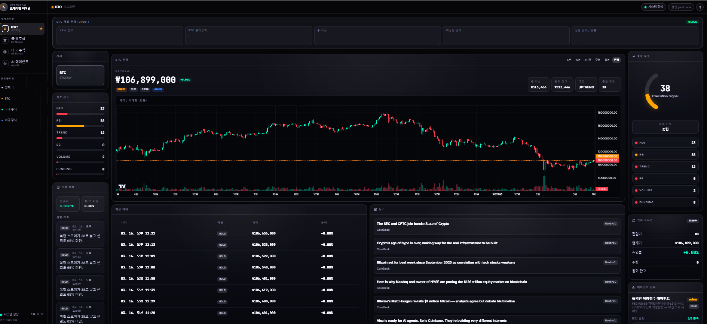
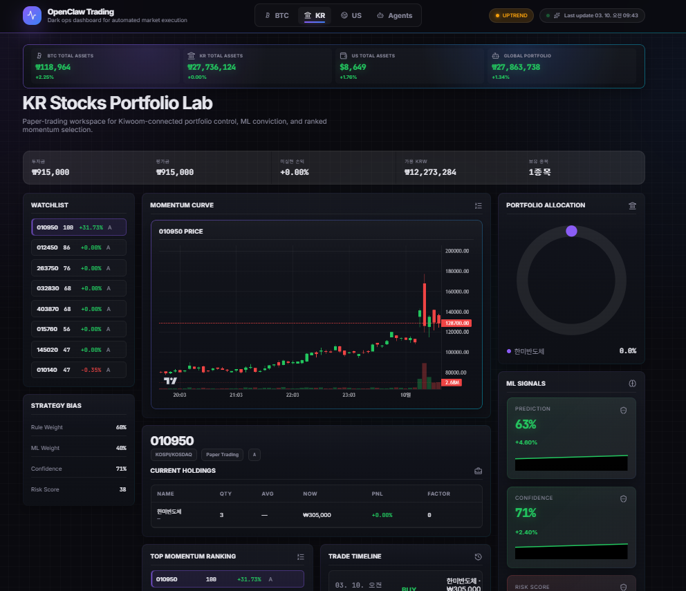
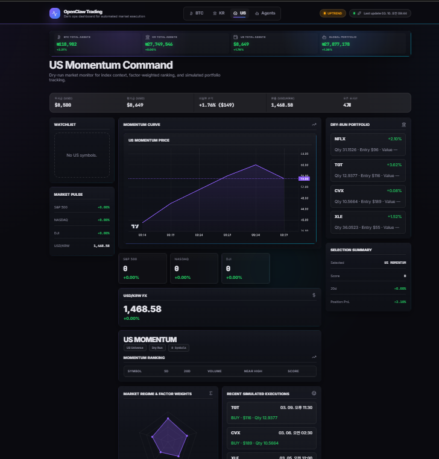
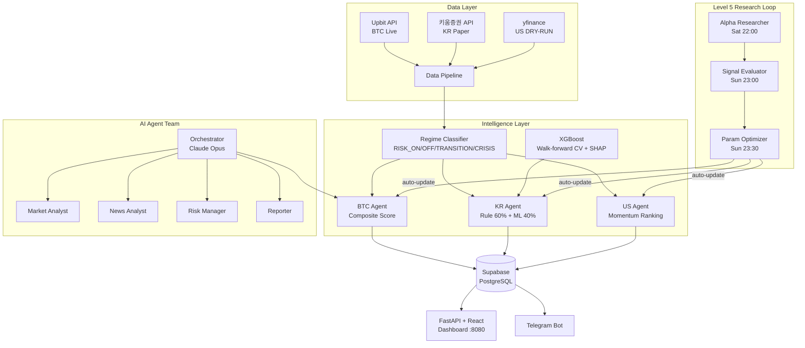

# OpenClaw Trading System

<p align="center"><strong>BTC · KR Stocks · US Stocks — Fully Automated Trading Platform with Research-to-Production Loop</strong></p>

<p align="center">
  <a href="https://www.python.org/downloads/"></a>
  <a href="LICENSE"></a>
  
  
  
  
  <a href="https://github.com/zln02/openclaw-trading/stargazers"></a>
</p>

<p align="center">
  <a href="README.ko.md">Korean README</a> ·
  <a href="docs/SCREENSHOT_GUIDE.md">Screenshot Guide</a>
</p>

- **3-Market Coverage:** BTC (live) + KR Stocks (paper) + US Stocks (dry-run)
- **Level 5 Research Loop:** Automated alpha discovery → IC/IR validation → parameter auto-tuning
- **AI Agent Team:** 5 Claude agents support analysis, risk review, and reporting

## Demo

<p align="center">
  
  <br />
  <strong>BTC Dashboard</strong>
</p>
<!-- 📸 SCREENSHOT: BTC 대시보드 탭. 캔들차트 + 복합스코어 게이지 + 포지션 카드 + F&G 인디케이터가 보이게 캡처. 브라우저 주소창 제거. 1280x720 권장 -->

<p align="center">
  
  <br />
  <strong>KR Stocks</strong>
</p>
<!-- 📸 SCREENSHOT: KR 주식 탭. 포트폴리오 원형차트 + 보유종목 테이블 + TOP 모멘텀 랭킹이 보이게 캡처. 1280x720 -->

<p align="center">
  
  <br />
  <strong>US Stocks</strong>
</p>
<!-- 📸 SCREENSHOT: US 주식 탭. 시장지수 카드 + 모멘텀 랭킹 테이블 + DRY-RUN 포지션이 보이게 캡처. 1280x720 -->

## Quick Start

```bash
git clone https://github.com/zln02/openclaw-trading
cd openclaw-trading
cp .env.example .env  # Add your API keys
docker-compose up -d
open http://localhost:8080
```

## Features

<details>
<summary><strong>Multi-Market Trading Engine</strong></summary>

OpenClaw Trading System runs three market modes in one operational stack:

- BTC live trading with composite signals, regime-aware filters, F&G context, and real execution tracking.
- KR stocks paper trading with rule-based logic, XGBoost overlays, portfolio monitoring, and Kiwoom integration.
- US stocks dry-run momentum execution with market-state cards, momentum ranking, and simulated order flow.

Operational conventions currently used in the repository:

- BTC runs continuously and is monitored through log freshness and dashboard health probes.
- KR stock cycles are designed around weekday intraday trading, premarket preparation, and separate check cycles.
- US flow is intentionally isolated as DRY-RUN while momentum ranking, daily reports, and market APIs are hardened.

</details>

<details>
<summary><strong>Strategy Layer</strong></summary>

The system combines multiple signal families rather than a single indicator:

- BTC composite scoring merges RSI, Bollinger context, regime state, funding, open interest, volatility filters, and market sentiment.
- KR stocks blend rule-based ranking with ML-assisted selection and portfolio controls such as max positions and sector constraints.
- US stocks focus on momentum ranking, market regime awareness, volatility gating, and execution discipline before live deployment.

Risk assumptions are centralized in shared defaults and overridden per agent where needed:

- Position sizing and invest ratios
- Stop-loss / take-profit / trailing stop behavior
- Max trades per day and cooldown windows
- Market-specific constraints such as VIX or Kimchi premium filters

</details>

<details>
<summary><strong>Level 5 Research Loop</strong></summary>

The repository includes a research-to-production loop that continuously improves live parameters:

- `quant/alpha_researcher.py` explores new signal hypotheses and parameter grids.
- `quant/signal_evaluator.py` validates IC/IR and tracks whether signals remain production-worthy.
- `quant/param_optimizer.py` can auto-tune parameters after evaluation and feed results back to runtime agents.
- Research outputs are designed to influence BTC, KR, and US parameter sets rather than stay trapped in notebooks.

Road-tested workflow in the repo:

1. Discover candidate features and signal variants.
2. Validate with walk-forward style checks and IC/IR thresholds.
3. Auto-update production parameters where improvement exceeds replacement thresholds.
4. Observe downstream changes through alerts, daily/weekly reports, and dashboard state.

</details>

<details>
<summary><strong>AI Agent Team</strong></summary>

The orchestration layer is built around specialized Claude-based agents:

- Market Analyst
- News Analyst
- Risk Manager
- Reporter
- Orchestrator

These agents support:

- Regime interpretation
- Research review and strategy revision
- Alert generation
- Daily and weekly reporting
- Decision traceability through the dashboard and logs

</details>

<details>
<summary><strong>Dashboard, Alerts, and Reporting</strong></summary>

The dashboard stack exposes market-specific views and operating telemetry:

- BTC dashboard: candles, composite score, positions, sentiment context
- KR dashboard: holdings, portfolio mix, ranking tables, market summary
- US dashboard: major index cards, momentum ranking, dry-run positions

Alerting and reporting currently include:

- Telegram buy/sell alerts
- Daily trading reports
- Weekly strategy reviews
- Health status snapshots
- Drawdown / VaR / correlation / volume-spike alerts

</details>

<details>
<summary><strong>Security and Operations</strong></summary>

This repository is opinionated about local-first operations:

- Runtime paths resolve from `OPENCLAW_CONFIG_DIR`, `OPENCLAW_WORKSPACE_DIR`, `OPENCLAW_LOG_DIR`, and `OPENCLAW_CONFIG_PATH`.
- `.env` files are parsed as data, not executed with `source`.
- Health checks now write a machine-readable status snapshot to `~/.openclaw/logs/health_status.json`.
- Shell wrappers were normalized so cron tasks and manual runs share the same path and env resolution model.

Operational guidance reflected from the existing docs:

- Treat inbound chat surfaces and external market APIs as untrusted.
- Keep API keys out of git and local-only artifacts out of commits.
- Add explicit dashboard health endpoints and fallback behavior for rate-limited broker/API integrations.
- Use paper or dry-run modes before promoting changes to live capital.

</details>

<details>
<summary><strong>Core OpenClaw Platform Foundation</strong></summary>

The trading system is built on top of the broader OpenClaw platform:

- Gateway-based local control plane
- Multi-channel messaging support
- Dashboard/web surfaces
- Skill and automation infrastructure
- Remote operations and daemonized runtime

That means this repository is both:

- A trading operations workspace
- An application layer running on the OpenClaw runtime

</details>

## Architecture


```mermaid
graph TB

subgraph "Data Layer"

U[Upbit API
BTC Live] --> K[Data Pipeline]

KW[키움증권 API
KR Paper] --> K

YF[yfinance
US DRY-RUN] --> K

end

subgraph "Intelligence Layer"

K --> RC[Regime Classifier
RISK_ON/OFF/TRANSITION/CRISIS]

RC --> BTC[BTC Agent
Composite Score]

RC --> KR[KR Agent
Rule 60% + ML 40%]

RC --> US[US Agent
Momentum Ranking]

ML[XGBoost
Walk-forward CV + SHAP] --> KR

end

subgraph "Level 5 Research Loop"

AR[Alpha Researcher
Sat 22:00] --> SE[Signal Evaluator
Sun 23:00]

SE --> PO[Param Optimizer
Sun 23:30]

PO -->|auto-update| BTC & KR & US

end

subgraph "AI Agent Team"

ORC[Orchestrator
Claude Opus] --> MA[Market Analyst]

ORC --> NA[News Analyst]

ORC --> RM[Risk Manager]

ORC --> RP[Reporter]

end

BTC & KR & US --> DB[(Supabase
PostgreSQL)]

DB --> DASH[FastAPI + React
Dashboard :8080]

DB --> TG[Telegram Bot]

ORC --> BTC
```

## Project Structure

<details>
<summary><strong>Expand project tree</strong></summary>

```text
.
├── agents/              # AI agent team, alerts, daily reports, weekly reviews
├── btc/                 # BTC live trading logic, dashboard entrypoints, BTC APIs
├── common/              # Shared config, env loading, logging, retry, Telegram, Supabase
├── dashboard/           # Frontend assets for dashboard/web UI
├── docs/                # Documentation, deployment notes, screenshot guide, audit docs
├── execution/           # Execution quality, router, TWAP/VWAP, slippage tracking
├── quant/               # Research loop, factor analysis, risk, portfolio, backtesting
├── schema/              # SQL schema definitions
├── scripts/             # Cron wrappers, health checks, dashboard runners, packaging helpers
├── secretary/           # Autonomous helper utilities and local memory tooling
├── stocks/              # KR/US trading agents, ML models, broker integration, collectors
├── supabase/            # Supabase-related schema files
├── test/                # TypeScript-side tests
├── tests/               # Python-side unit and phase tests
├── docker-compose.yml   # Containerized local runtime
├── README.md            # English README
└── README.ko.md         # Korean README
```

</details>

## Roadmap

- [x] Level 3: Adaptive Composite Signals
- [x] Level 4: Factor Model Operations (IC/IR → Weights)
- [x] Level 5: Research-to-Production Loop
- [ ] Level 6: Multi-Strategy Portfolio (Long-Short + Market Neutral)
- [ ] Level 7: On-chain DEX Arbitrage
- [ ] Public API for external trader integration
- [ ] Mobile Dashboard (React Native)

## Contributing

See [CONTRIBUTING.md](CONTRIBUTING.md).

## License

This project is licensed under the MIT License. See [LICENSE](LICENSE).
